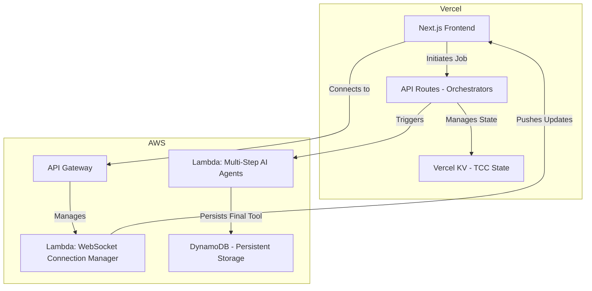
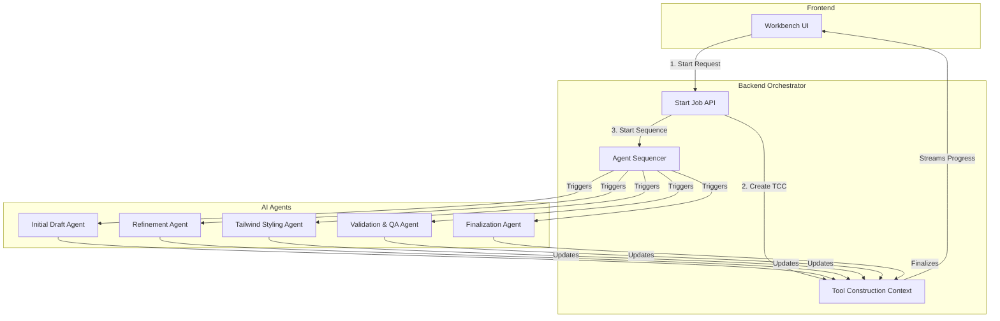

# Keyvex Technical Outline & Implementation Strategy (V2)

## 1. Executive Summary

Keyvex is an AI-powered platform that enables independent consultants, coaches, and B2B service providers to create interactive lead magnets (calculators, quizzes, assessments) through AI co-creation. The platform's core is a **V2 multi-agent orchestration architecture** that transforms natural language requirements into fully functional, interactive React tools. 

This system emphasizes real-time streaming AI interactions, robust validation, and professional-grade UI/UX, while managing Vercel timeout constraints through a hybrid Vercel/AWS architecture. It also features comprehensive user behavior learning for personalized AI experiences and a multi-layered data storage strategy for resilience and performance.

---

## 2. Core Architecture Strategy

### 2.1. Hybrid Vercel + AWS Architecture

The system uses a hybrid cloud strategy to leverage the strengths of both Vercel and AWS, ensuring a seamless developer experience, high performance, and scalability.

-   **Primary Stack (Vercel-First with AWS Backend):**
    -   **Frontend**: Next.js 14 with App Router, hosted on Vercel for fast, dynamic rendering and an optimal developer workflow.
    -   **State & Coordination**: Vercel KV (Redis) is used to store the **Tool Construction Context (TCC)**, enabling fast, cross-agent state management and synchronization with mutex locks.
    -   **Backend Logic**: AWS Lambda is used for long-running, complex processes that would exceed Vercel's function timeout limits.
    -   **Real-time Communication**: AWS API Gateway and Lambda manage persistent WebSocket connections for real-time progress updates to the frontend.

### 2.2. V2 Multi-Agent Tool Creation System

The V2 system is the cornerstone of Keyvex's dynamic tool generation. It moves away from monolithic API calls to a collaborative, multi-agent workflow managed by an orchestrator.

#### Orchestration Flow

The process is managed by orchestrator endpoints that trigger specialized AI agents in a sequence. The frontend initiates a job, receives a `jobId`, and then listens for real-time progress updates via a WebSocket connection. This asynchronous flow is resilient to timeouts and provides a transparent user experience.

#### The Tool Construction Context (TCC)

The TCC is the central, shared state object for any given tool creation job. It contains all information related to the tool, including the user's prompt, generated code, validation results, and agent-specific metadata.

-   **Structure**: A comprehensive JSON object containing fields like `jobId`, `userId`, `prompt`, `generatedCode`, `validationIssues`, `agentHistory`, etc.
-   **Storage**: Lives in Vercel KV for high-speed access across different serverless function invocations.
-   **Synchronization**: Utilizes **mutex locks** to prevent race conditions when multiple agents attempt to modify the TCC simultaneously, ensuring data integrity.

#### The Agentic Workflow

Each agent is a specialized, serverless function with a single responsibility, making the system modular and easy to maintain.

1.  **Initial Draft Agent**: Takes the user's prompt and generates the first version of the `ProductToolDefinition`, including the basic React component structure and initial state management.
2.  **Refinement Agent**: Iteratively improves the draft based on a set of predefined quality heuristics or further user input. It focuses on logic, props, and state flow.
3.  **Tailwind Styling Agent**: Applies a comprehensive and modern styling system using Tailwind CSS utility classes. It ensures the tool adheres to a sophisticated grid-based layout rather than a simple vertical form.
4.  **Validation & QA Agent**: A critical step that performs a multi-point inspection on the generated code. It runs a suite of checks (see Quality Assurance section below) and populates the TCC with any issues found.
5.  **Finalization Agent**: Performs final cleanup, formats the code, and prepares the `ProductToolDefinition` for storage and rendering on the frontend.

--- 

## 3. Quality, UI, and Component Architecture

### 3.1. Real-Time Quality Assurance & Validation

Quality is enforced through an automated, multi-layered validation system that runs during the agentic workflow.

-   **Validation Categories**: Issues are categorized by severity:
    -   **Blocking Errors**: Critical issues that prevent the tool from being completed (e.g., invalid React syntax, missing required imports). The workflow is halted until an auto-fix is applied or the user intervenes.
    -   **Non-Blocking Warnings**: Suggestions for improvement that do not break functionality (e.g., suboptimal layout, missing accessibility props).
-   **AI Tool Fixer**: An automated sub-system that can resolve common issues, such as converting arrow functions to standard function declarations to ensure compatibility with the dynamic renderer.
-   **Enhanced Debugging**: All `TRACE` logs include function name identifiers for clearer, more precise debugging during development.

### 3.2. UI/UX and Component Standards

A professional and consistent user experience is non-negotiable. This is achieved through strict component and styling guidelines.

-   **ShadCN Component Mandate**: Development guidelines require the use of ShadCN components to ensure a high-quality, consistent, and modern UI.
-   **Mandatory Main Card Wrapper**: All tools must be wrapped in a primary ShadCN `Card` component to ensure a consistent visual container.
-   **Mandatory Info Popup System**: All tool headers must include a comprehensive info tooltip using ShadCN `Tooltip` components, improving user guidance and clarity.
-   **Modular Component Architecture**: All production-ready UI components are extracted from test implementations into a modular `/components/tool-creator-ui/` hierarchy, promoting reusability and maintainability.

--- 

## 4. Data, State, and Communication

### 4.1. Multi-Layer Storage Strategy

The platform uses a robust, multi-layered storage approach to ensure data persistence, resilience, and performance.

-   **IndexedDB (Primary)**: The browser's IndexedDB is the primary storage location for a user's created tools, allowing for fast, offline access and reducing reliance on constant server communication.
-   **DynamoDB (Cloud Backup)**: All tools saved in IndexedDB are automatically backed up to DynamoDB. This provides a persistent, secure cloud copy for data recovery and multi-device access.
-   **localStorage (Cache)**: The browser's localStorage is used for caching non-critical session data and user preferences.

### 4.2. Real-Time Frontend Communication

The frontend workbench is kept in sync with the backend orchestration process via an enhanced WebSocket connection.

-   **AWS API Gateway**: Manages the WebSocket lifecycle, providing a stable connection point for the frontend.
-   **User Connection Management**: A Lambda function tracks active user connections, ensuring that progress updates are routed only to the correct user.
-   **StepProgress Protocol**: The backend sends structured `StepProgress` messages containing the latest version of the TCC, allowing the UI to render real-time logs, validation issues, and code updates as they happen.

### 4.3. User Behavior Learning & AI Personalization

The system actively learns from user interactions to create a personalized and adaptive co-creation experience.

-   **Real-time Interaction Tracking**: Captures response times, input preferences, editing patterns, and workflow choices during the tool creation process.
-   **Evolution Detection**: Automatically detects behavioral shifts, such as a user transitioning from a beginner to an expert.
-   **Adaptive AI Responses**: The AI agents can dynamically adjust question complexity, input types, and suggestions based on the user's learned profile, making the process more efficient and intuitive.